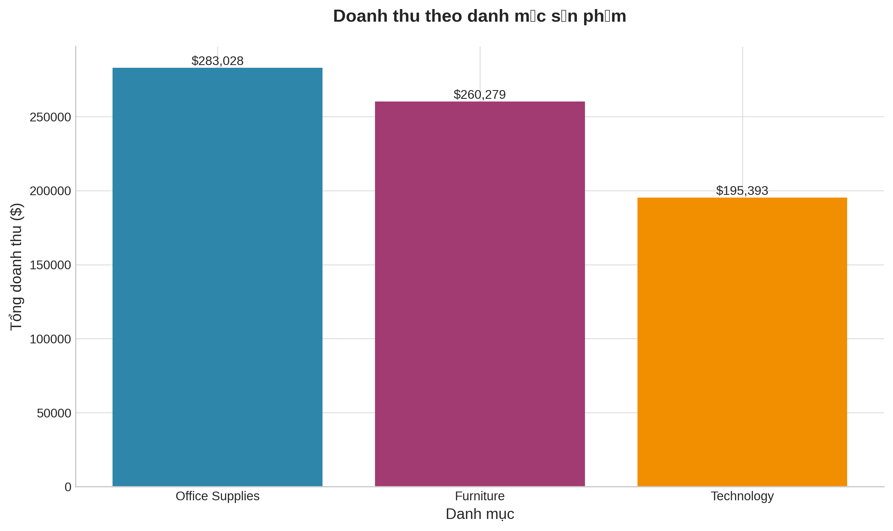
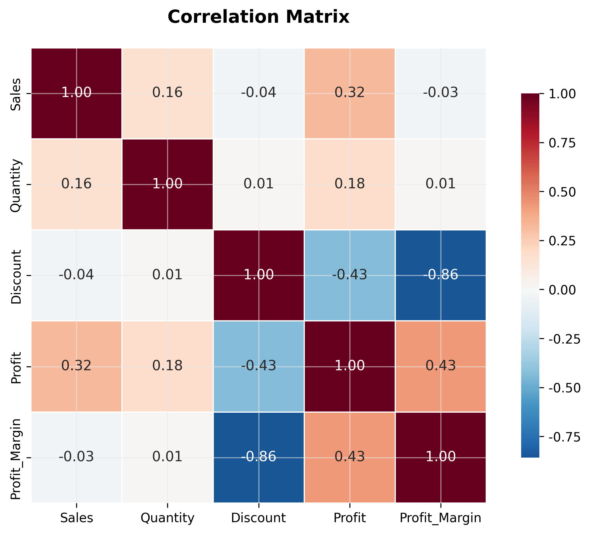
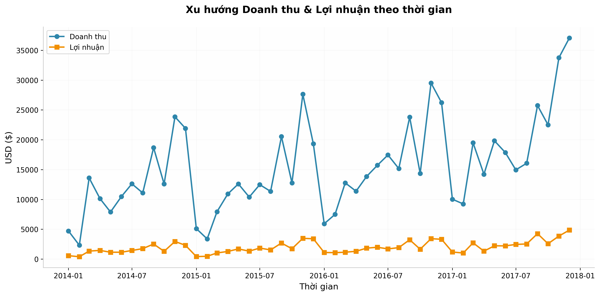
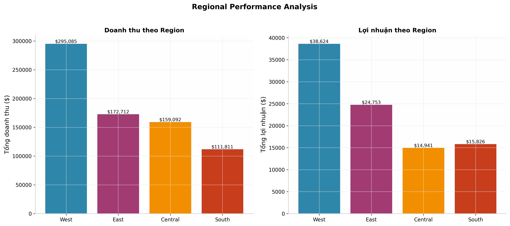
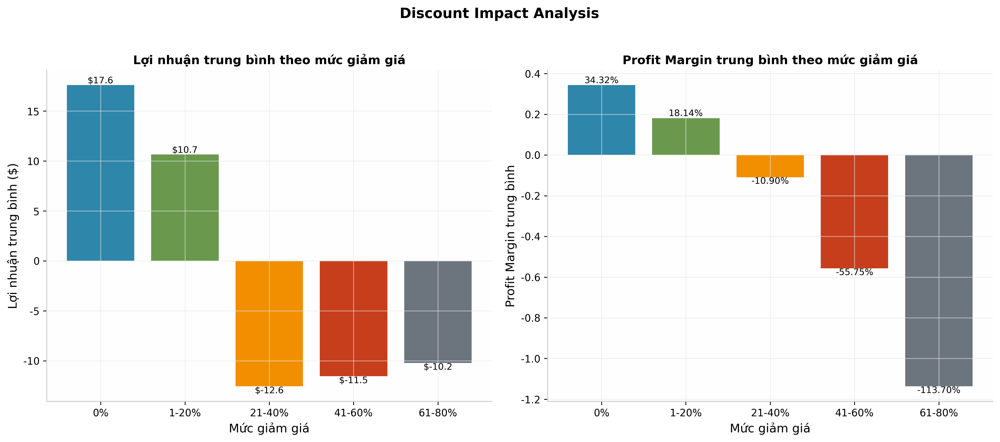
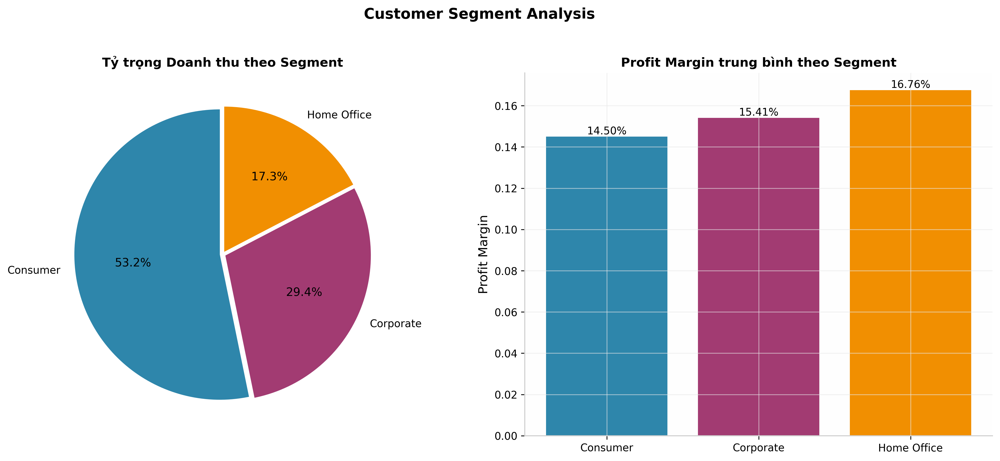
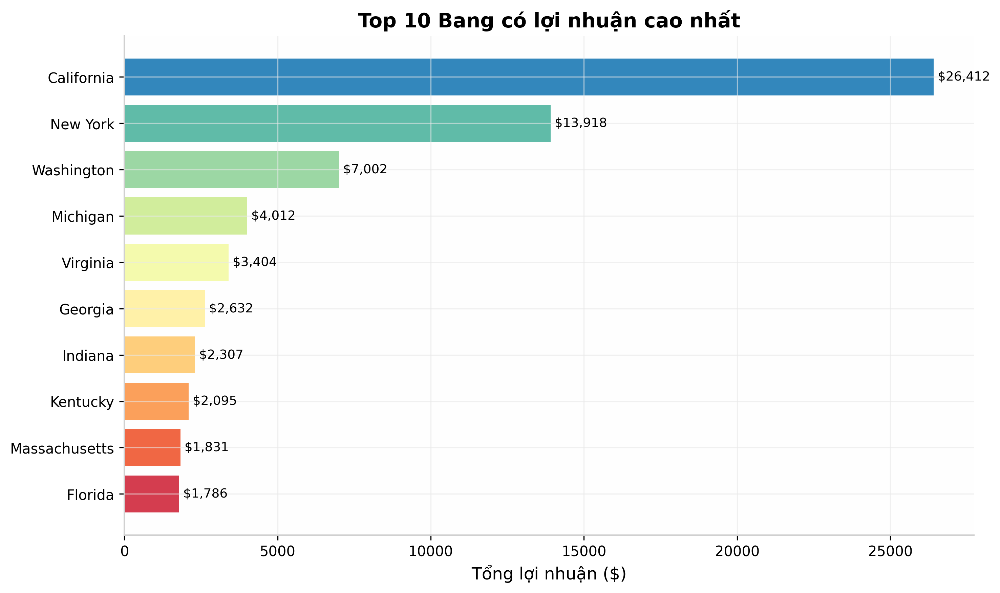

# Sales Performance Dashboard

> **Dự án phân tích dữ liệu bán hàng** 

---

##  Mục tiêu dự án

1. Phân tích doanh thu, lợi nhuận theo thời gian, khu vực, danh mục sản phẩm
2. Xác định top/bottom performing products và regions
3. Xây dựng dashboard tương tác cho việc theo dõi KPI
4. Đề xuất insights dựa trên dữ liệu

---

##  Dataset

- **Nguồn:** [Superstore Dataset Final — Kaggle](https://www.kaggle.com/datasets/vivek468/superstore-dataset-final)
- **Dữ liệu thật** từ Kaggle, được tải trực tiếp qua `kagglehub`
- **Kích thước:** 9,994 dòng × 21 cột
- **Thời gian:** 2014 — 2018
- **Các trường chính:**
  - Order info: `Order ID`, `Order Date`, `Ship Date`, `Ship Mode`
  - Customer info: `Customer ID`, `Customer Name`, `Segment`, `Region`, `State`
  - Product info: `Category`, `Sub-Category`, `Product Name`
  - Financial: `Sales`, `Quantity`, `Discount`, `Profit`

---

## Kiến trúc 

```
┌─────────────────┐     ┌──────────────────┐     ┌───────────────┐
│  Data Collection│ --> │ Data Cleaning    │ --> │ Data Analysis │
│  (Kaggle)       │     │ (Python/Pandas)  │     │ (SQL/Python)  │
└─────────────────┘     └──────────────────┘     └───────────────┘
                                                          |
┌─────────────────┐     ┌──────────────────┐              |
│  Reporting      │ <-- │ Data Visualization|<-----------┘
│  & Insights     │     │ (Matplotlib/     │
│                 │     │  Seaborn/Plotly) │
└─────────────────┘     └──────────────────┘
```

---

##  Cấu trúc thư mục

```
sales-performance-dashboard/
├── data/
│   ├── superstore_raw.csv          # Dataset gốc từ Kaggle
│   └── superstore_cleaned.csv      # Dataset sau khi làm sạch (loại outliers IQR)
├── notebooks/
│   └── EDA_Superstore.ipynb        # Jupyter Notebook phân tích toàn diện
├── sql/
│   └── sales_analysis.sql          # Các truy vấn SQL phân tích
├── images/
│   ├── sales_by_category.png       # Doanh thu theo danh mục
│   ├── correlation_heatmap.png     # Ma trận tương quan
│   ├── sales_trend.png             # Xu hướng doanh thu theo thời gian
│   ├── regional_performance.png    # Phân tích theo khu vực
│   ├── discount_impact.png         # Tác động của giảm giá
│   ├── segment_analysis.png        # Phân tích phân khúc khách hàng
│   └── top_states_profit.png     # Top 10 bang lợi nhuận cao nhất
├── powerbi/
│   └── (Dashboard file .pbix nếu có)
├── README.md
└── requirements.txt
```

---

##  Công nghệ sử dụng

| Công cụ | Mục đích |
|---------|----------|
| **Python** | Ngôn ngữ phân tích chính |
| **Pandas** | Xử lý và làm sạch dữ liệu |
| **Matplotlib / Seaborn** | Trực quan hóa dữ liệu |
| **SQLite** | Truy vấn và tổng hợp dữ liệu (SQL) |
| **Jupyter Notebook** | Môi trường phân tích tương tác |
| **KaggleHub** | Tải dataset trực tiếp từ Kaggle |
| **Git/GitHub** | Quản lý phiên bản và chia sẻ |

---

##  Hướng dẫn cài đặt & chạy

### 1. Clone repository

```bash
git clone https://github.com/Yenhoang2409/sales-performance-dashboardd.git
cd sales-performance-dashboardd
```

### 2. Cài đặt dependencies

```bash
pip install -r requirements.txt
```

### 3. Chạy Jupyter Notebook

```bash
jupyter notebook notebooks/EDA_Superstore.ipynb
```

---

##  Quy trình phân tích chi tiết

### Bước 1: Thu thập dữ liệu (Data Collection)

Dataset được tải trực tiếp từ Kaggle bằng `kagglehub`:

```python
import kagglehub
path = kagglehub.dataset_download("vivek468/superstore-dataset-final")
df = pd.read_csv(f"{path}/Sample - Superstore.csv", encoding='latin1')
```

### Bước 2: Làm sạch dữ liệu (Data Cleaning)

- **Chuyển đổi kiểu dữ liệu:** `Order Date`, `Ship Date` → datetime
- **Tạo feature mới:** `Profit_Margin` = Profit / Sales
- **Xử lý outliers:** IQR method trên cột `Profit`
  - Q1 = 1.73, Q3 = 29.36, IQR = 27.64
  - Loại bỏ 1,881 dòng outliers (18.8%)
- **Kết quả:** Dataset sạch với 8,113 dòng

### Bước 3: Phân tích với SQL

Các truy vấn chính được lưu trong `sql/sales_analysis.sql`:

```sql
-- Doanh thu theo danh mục sản phẩm
SELECT 
    Category,
    SUM(Sales) AS Total_Sales,
    SUM(Profit) AS Total_Profit,
    AVG(Profit_Margin) AS Avg_Margin
FROM superstore
GROUP BY Category
ORDER BY Total_Sales DESC;

-- Top 5 bang có lợi nhuận cao nhất
SELECT State, SUM(Profit) AS Total_Profit
FROM superstore
GROUP BY State
ORDER BY Total_Profit DESC
LIMIT 5;

-- Xu hướng doanh thu theo tháng
SELECT strftime('%Y-%m', "Order Date") AS Month,
       SUM(Sales) AS Monthly_Sales
FROM superstore
GROUP BY Month
ORDER BY Month;
```

### Bước 4: Trực quan hóa (Visualization)

7 hình ảnh phân tích được tạo ra trong thư mục `images/`:

| Hình ảnh | Nội dung |
|----------|----------|
| `sales_by_category.png` | So sánh doanh thu 3 danh mục: Office Supplies, Furniture, Technology |
| `correlation_heatmap.png` | Ma trận tương quan giữa Sales, Quantity, Discount, Profit, Profit_Margin |
| `sales_trend.png` | Xu hướng doanh thu & lợi nhuận theo tháng (2014–2018) |
| `regional_performance.png` | So sánh doanh thu và lợi nhuận 4 vùng: West, East, Central, South |
| `discount_impact.png` | Phân tích tác động của mức giảm giá đến lợi nhuận |
| `segment_analysis.png` | Tỷ trọng doanh thu và Profit Margin theo phân khúc khách hàng |
| `top_states_profit.png` | Top 10 bang đóng góp lợi nhuận cao nhất |

---

##  Key Findings & Insights

### 1. Office Supplies dẫn đầu doanh thu với Profit Margin tốt nhất
- **Office Supplies:** $283K doanh thu (36.8%), Profit Margin **16.6%**
- **Furniture:** $260K doanh thu nhưng Profit Margin chỉ **10.6%** — cần cải thiện
- **Technology:** $195K doanh thu, Profit Margin **14.6%**

### 2. California, New York, Washington chiếm phần lớn lợi nhuận
- **California:** $26.4K lợi nhuận (gấp ~2x New York)
- **New York:** $13.9K
- **Washington:** $7.0K
- 3 bang này cùng đóng góp **> 45%** tổng lợi nhuận toàn quốc

### 3.  Discount cao (>20%) = Profit âm
- **0% discount:** Profit Margin **34.3%**
- **1–20% discount:** Profit Margin **18.1%**
- **21–40% discount:** Profit Margin **-10.9%** 
- **41–60% discount:** Profit Margin **-55.8%** 
- **>60% discount:** Profit Margin **-113.7%** 

**Insight:** Chính sách giảm giá mạnh đang phá hủy lợi nhuận. Cần giới hạn discount tối đa 20%.

### 4. Consumer segment chiếm đa số doanh thu nhưng không phải margin cao nhất
- **Consumer:** 53.2% doanh thu, Profit Margin **14.5%**
- **Corporate:** 29.4% doanh thu, Profit Margin **15.4%**
- **Home Office:** 17.3% doanh thu, Profit Margin **16.8%** cao nhất

### 5. West Region dẫn đầu toàn diện
- **West:** $295K doanh thu | $38.6K lợi nhuận
- **East:** $172K doanh thu | $24.8K lợi nhuận
- **Central:** $159K doanh thu | $14.9K lợi nhuận
- **South:** $111K doanh thu | $15.8K lợi nhuận

---

##  Recommendations (Đề xuất hành động)

| Priority | Action | Expected Impact |
|----------|--------|-----------------|
| High | **Giới hạn discount ≤ 20%** | Tăng profit margin toàn công ty |
| High | **Tối ưu Furniture category** | Cải thiện margin thấp nhất nhóm |
| Medium | **Mở rộng Office Supplies** | Tận dụng category có margin tốt nhất |
| Medium | **Tăng marketing cho Home Office** | Khai thác segment có margin cao nhất |
| Low | **Cải thiện Central Region** | Điều tra nguyên nhân lợi nhuận thấp |

---

## Demo Hình ảnh

### Doanh thu theo danh mục


### Correlation Heatmap


### Xu hướng theo thời gian


### Regional Performance


### Discount Impact


### Segment Analysis


### Top States


---

## Kiến thức áp dụng

| Cấp độ | Nội dung | Trạng thái |
|--------|----------|------------|
| **Descriptive** | Mô tả dữ liệu (mean, median, distribution) |  Hoàn thành |
| **Diagnostic** | Phân tích nguyên nhân (discount vs profit, regional gap) | Hoàn thành |
| **Predictive** | Dự đoán xu hướng (time series trend) | Cơ bản |
| **Prescriptive** | Đề xuất hành động (recommendations) | Hoàn thành |

---

## License

Dataset được sử dụng theo [Kaggle Dataset License](https://www.kaggle.com/datasets/vivek468/superstore-dataset-final).
Code trong repository này được chia sẻ dưới giấy phép MIT.

---

## Liên hệ

- **Author:** Hoàng Yến
- **Repository:*  https://github.com/Yenhoang2409/sales-performance-dashboardd.git *
- **LinkedIn:** *www.linkedin.com/in/hoàng-yến-9a972b391*

---


